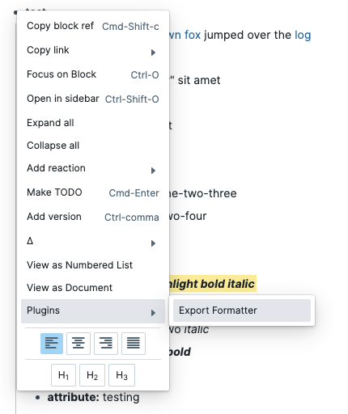
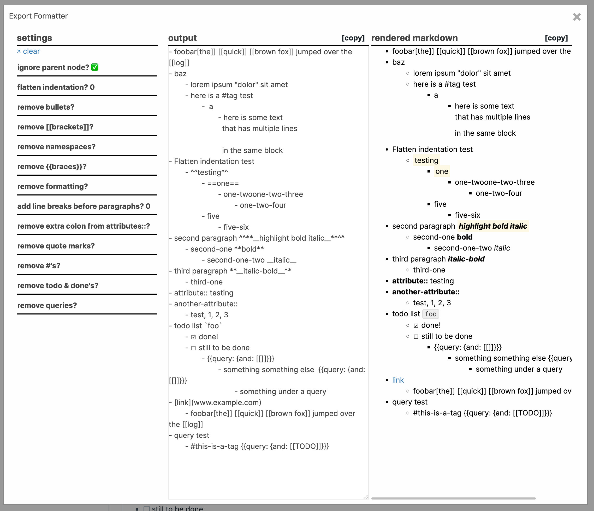

# Roam Depot: Export Formatter

Adds a context menu option to export the selected node with various formatting options, such as removing roam specific syntax, making it suitable to share in emails, slack or other places. A port of my previous project: https://roam-tools.ryanguill.com / https://github.com/ryanguill/roam-tools

To use: select a node in your graph, right click and choose Plugins -> Export Formatter

Issues and PRs welcome: https://github.com/ryanguill/roam-depot-export-formatter/issues
